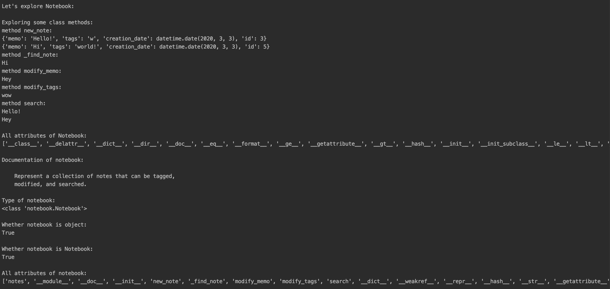

**notebook**

This program consists of two modules: notebook and menu.
Module notebook that includes two classes: Note and Notebook is used in order to make new notes in notebook. Here you can also modify your notes.
Using module menu you will be shown the menu which consists of 5 elements. You can choose anyone. According to this menu you can look at all notes, search notes, add new notes, modify them or quit.
You can use module notebook_test to test all the classes with its attributes and methods.

**results of launching**

note:

notebook:

menu:

**conclusion**

You can easily use these modules if you want to make notes or check all your notebook.
